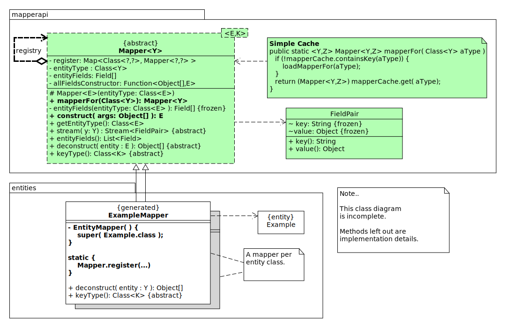

== Generic Mapper.

[.lead]
A *mapper* is a technical term that describes that something is turned into something else.
That still sounds dangerous like turning naughty kids into frogs, but in this case it
is simply turning an object into something the other side can deal with. Like
turning a student object into an array of its constituting parts, so it can be put into a database
or sent across a wire. Mwah, still sounds scary...

The mapper below can turn an entity into an array of Object, and vise-versa,
can *Stream* the object as Field-value pairs or as name-value pairs, and can provide other (meta) information
about the fields as a list of **Field**s of the entity class when needed.

The deconstructor part is the same as the deconstructor in the previous exercises.

A *Mapper* takes the responsibility of reflecting on an entity type, and be able to
extract information from the class, to be able to manipulate the instances of the entity type.
To services it provides are:

* Constructing and deconstructing entities of the type.
* Providing and caching the meta information of the type.
* Providing the identity-type of the entity. In many uses of mappers, such as databases or mapping, +
 the key type of the identity field is important, so that is kept to.
* Do expensive and difficult reflection operations once and cache the collected information.

The Mapper you will create in this exercise can be a building block in the 'Plumbing' of your application,
and can be extended with functionality as needed.

++++

GenericMapper

++++

To get to this exercise, we started with copy and pasting, the deconstructor bits and combined them into this new and
final project and functionality. You do not have to do the copying, that has already been done in the new project.

.The Generic Mapper class diagram

The mapper we create is a continuation of the Deconstructor and DeconstructorGenerator and brings it
all together as a library/API and the accompanying Generator in one package/module.

We started with the deconstructorregistry project. Simply copy the classes over to the new project and refactor the name of
the Deconstructor to Mapper, because it will become one quite soon.
Also refactor/rename the Leaf mappers generated by your deconstructorgenerator to *XXXMapper*, and while you are at it, rename the
DeconstructorGenerator to MapperGenerator, because that is its final role.

As far as the deconstruction part of the mapper is concerned, we are done. We can now also lookup mappers using the mechanism explored in the
the DeconstructorRegistry exercise.

The missing bits are the meta data we want to keep (cache) for the entity class, so we have the meta data, such as field name and type
handy.

* Reflect on the type (Class<E>.class) to find the *declared fields*, and save this info in an array for later use. (Cache it).
* Use the types of the declared fields to create a MethodType Object matching a *constructor* of the entity that takes all fields.
** If the programmer has his constructor created by the IDE, and selected all fields, then you should be fine.
* `unreflect` the constructor to get a [blue]`MethodHandle` and use that to create Function<Object[],E>, which is equivalent to
  a factory method that calls a constructor to create an entity. Save this function object as field in the mapper.
* Keep the entityType for later reference in a field and provide an [blue]`abstract Class<?> keyType()` method, so we can ask the subclass for the
  type of `<K>.`

.Creating the method type for a Constructor that takes all fields
[source,java]
----
    Class[] fieldTypes = ...               // <1>
    MethodType ctorType = MethodType.methodType( void.class, fieldTypes ); <2>
----

<1> Use the saved field types.
<2> Get the method handle.

With the above, our mapper is almost done.

You can now implement the `public Stream<FieldPair> stream(E e)` +

* Start by getting the fields via the deconstruct method.
* Use an https://docs.oracle.com/en/java/javase/11/docs/api/java.base/java/util/stream/IntStream.html[IntStream]
to generate the indices to visit all elements of the field array:
`IntStream.range( 0, fields.length )`.
* Map (with mapToObj) each index to a [blue]`new FieldPair`, whereby you take the key from the name of the fields array,
and the value from the deconstructed [blue]`Object[]`.
* Return the resulting array.

.Stream an entity as Stream of **FieldPair**s
[source,java]
----
    public Stream<FieldPair> stream( E entity ) {
        Object[] fieldValues = deconstruct( entity ); // <1>
        return IntStream
                .range( 0, entityFields.length )      // <2>
                .mapToObj( i -> new FieldPair( entityFields[i].getName(),
                fieldValues[i] )
                );
    }
----

<1> cached array fieldValues and
<2> deconstuctor result array have the same length by definition.

Done.

*The mapper can now be used as follows:*

.Student mapper in action one  a Student.
[source,java]
----
    static Object[] studentArgs = new Object[]{
        snummer, lastName, tussenVoegsel, firstName, dob, cohort, email, gender,
        group, true
    };

    static Student jan = new Student(
            snummer, lastName, tussenVoegsel, firstName, dob, cohort, email,
            gender, group, true
    );

    @Test
    public void tStudentMapperConstructs() {
         Mapper<Student,Integer> mapper = Mapper.mapperFor( Student.class );
         Student xJan = mapper.construct( sData );
         assertThat( xJan ).usingRecursiveComparison().isEqualTo( jan );
     }

     //@Disabled("Think TDD")
     @Test
     public void tStudentMapperDeconstructs() {
         Mapper<Student,Integer> mapper = Mapper.mapperFor( Student.class );
         Object[] deconstruct = mapper.deconstruct( jan );
         assertThat( deconstruct ).isEqualTo( sData );
     }
----

We also expanded on the idea of generating the leaf deconstructors. In this case
we have a MapperGenerator that uses a template to generate mappers. The generating part
is almost exactly the same as in the deconstructor generator exercise. Only the test data is a bit longer.

.Here is the Template
[source,java]
----
package %1$s;

import %2$s;
import genericmapper.Mapper;
import java.util.function.Function;

/**
 * Generated code. Do not edit, your changes will be lost.
 */
public class %3$sMapper extends Mapper<%3$s, %4$s> {

    // No public ctor
    private %3$sMapper() {
        super( %3$s.class );
    }

    // self register
    static {
        Mapper.register( new %3$sMapper() );
    }

    // the method that it is all about
    @Override
    public Object[] deconstruct(  %3$s %5$s ) {
           return new Object[]{
              %6$s
           };
    }

    @Override
    public Function<%3$s, %4$s> keyExtractor() {
        return ( %3$s %5$s ) -> %5$s.%7$s;
    }

    @Override
    public Class<%4$s> keyType() {
        return %4$s.class;

    }
}
----

++++

 <!--genericmapper -->
++++

[CAUTION]
====
When you have a class hierarchy, make sure that the fields are in the order you want.
At the moment of writing, NetBeans IDE creates the parameters for the constructor in the order sub class fields first, then super class.
You may either have to

* Refrain from using class hierarchies in your entities (probably wisest). +
 This is the advise Java 14 implicitly gives with the introduced https://www.infoq.com/news/2020/08/java16-records-instanceof/[record] feature which is final in Java 16.
* Take extra care when creating sub-_entities_
* Modify the mapper, that tries to resolve this potential problem be selecting the proper field order.

The later can be done by trying the top-down field order first and try the bottom-up order when that fails and then give up.
DO NOT try all possible mutations of the field order because that is a real big problem.

[big]*When you use the Mapper as above, do not forget to Generate the Mappers, otherwise
your program will almost certainly fail.*
====

//We (we teachers and you) will keep expanding on this concept, so stay tuned.

:sectnums:

== Use a Maven Plugin to generate mappers on the fly

[TIP]
====
To make the generic mapper even more useful, in particular for project 2, we have added
a maven plugin. Add the maven plugin as shown below to the maven project that contains the
entities.
====

.Automagically generate mapper with `mvn compile` in the entities project. Pom from AIS example PRJ2 revised-implementaion
[source,xml]
----
<?xml version="1.0" encoding="UTF-8"?>
<project xmlns="http://maven.apache.org/POM/4.0.0" xmlns:xsi="http://www.w3.org/2001/XMLSchema-instance" xsi:schemaLocation="http://maven.apache.org/POM/4.0.0 http://maven.apache.org/xsd/maven-4.0.0.xsd">
    <modelVersion>4.0.0</modelVersion>
    <parent>
        <groupId>fontys</groupId>
        <artifactId>AirlineInformationSystem</artifactId>
        <version>1.1-SNAPSHOT</version>
        <relativePath>..</relativePath>
    </parent>
    <artifactId>BusinessEntities</artifactId>
    <packaging>jar</packaging>
    <version>1.1-SNAPSHOT</version>
    <dependencies>
        <dependency>
            <groupId>nl.fontys.sebivenlo</groupId>
            <artifactId>sebiannotations</artifactId>
            <version>1.0-SNAPSHOT</version>
            <type>jar</type>
        </dependency>
        <dependency>
            <groupId>nl.fontys.sebivenlo</groupId>
            <artifactId>genericmapper</artifactId>
            <version>[2.2.0,)</version>  <!--1-->
            <type>jar</type>
            <scope>provided</scope>
        </dependency>
    </dependencies>
    <pluginRepositories>
        <pluginRepository>
            <id>sebiplugins</id>
            <url>https://www.fontysvenlo.org/repository/</url>
        </pluginRepository>
    </pluginRepositories>
    <build>
        <plugins>
            <plugin>
                <groupId>nl.fontys.sebivenlo</groupId>
                <artifactId>mapperplugin</artifactId> <!--2-->
                <version>1.0</version>
                <executions>
                    <execution>
                        <id>gen-src</id>
                        <phase>generate-sources</phase>
                        <goals>
                            <goal>sebimappergenerator</goal>
                        </goals>
                        <configuration>
                            <entityPackages>
                                <entityPackage>businessentities</entityPackage> <!--3-->
                            </entityPackages>
                            <classesDir>${basedir}/target/classes</classesDir> <!--4-->
                            <outDir>${basedir}/src/main/java</outDir> <!--5-->
                        </configuration>
                    </execution>
                </executions>
            </plugin>
        </plugins>
    </build>
</project>
----

<1> The mapper plugin has  groupId `nl.fontys.sebivenlo`, which should be no surprise, and the `artifactId` is mapper plugin.
<2> You need to have (on your pc) version 2.2.0 of the genericmapper. Change your version accordingly in the pom of project genericmapper22.
<3> Specify which package is processed by the plugin.
<4> Tell the mapper generator plugin where to look for entities `.class` files.
<5> Here you can set where the generated files land. This setting makes them land in the same package as the entities themselves.
  (That package is `businessentities` in the example).

You can also generate mapper in the test package. For that add an execution with a different id and with appropriate values for *classesDir* and *outDir*.

To make this work, you need an additional class [blue]`MapperGeneratorRunner`, given below, in the genericmapper project (for you in 2021 *genericmapper22*).

You may have to tweak your `MapperGenerator` a bit. In theory you can drop all static methods in that class,
since those have been moved to the runner. Call it a belated separation of concerns.

The code is also directly available as link:{exercises}/code/mappergeneratorrunner/src/main/java/genericmapper/MapperGeneratorRunner.java[raw]

The exerise projects (without solution, so the original exercises) are also on github, under ....

++++

GenericMapperRunner, code to add

++++

.MapperGeneratorRunner. There, I said it.
[source,java]
----
include::code/mappergeneratorrunner/src/main/java/genericmapper/MapperGeneratorRunner.java[]
----

++++

++++

Once you have added the class and updated your entities (sub) project, simply build the entities project (mvn package or mvn install),
and the entities will find their mappers alongside in the same package.

You may have to do a few tweaks in the Constants class, but they should be self evident.
When you are done, bump the version of the genericmapper to [black]`2.2.0` instead of [black]`2.2-SNAPSHOT`, so the mapperplugin can find it.

[TIP]
====
It is best to keep the entities in a separate package and maybe also in a maven project of their own.
====
